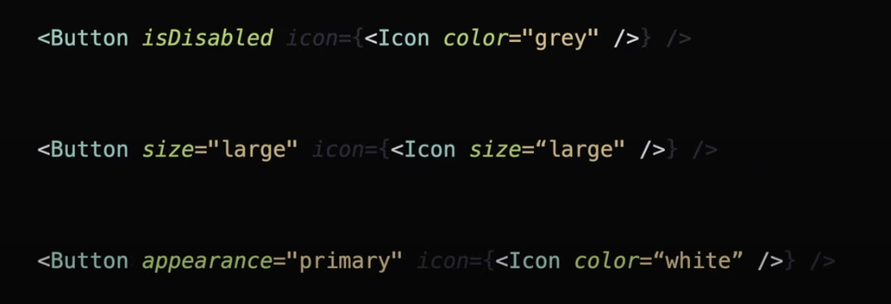

# Advanced React

1. React Lifecycle
2. Elements, children and Re-renders
3. Components as props
4. Render props
5. Mastering memoization
6. Masting Reconcilation
7. Making sense of Higher Order Component (HOC)
8. Controlled vs. Uncontrolled components
9. React Best Practices

## 1. React Lifecyle

1. Mounting: Component is added to the DOM. Instance + State + DOM init

- Instance creation: the component is initialized
- State initialization: states are setup
- DOM creation: React renders the component and inserts them into the DOM

2. Unmounting: Component is removed from the DOM

- Clean up logic: clearing timers, unsubscribing from listeners

3. Re-rendering

- Triggered by state change
- Faster than mounting through reuse: Making re-renders is faster than mounting. React reuses as much existing DOM elements where possible
- State update is triggered, the component re-renders
- Everything below the component is re-rendered
- The component itself and all the other components inside it will re-render
- The solution is to move state down to the lowest level possible
- The state should be as local as possible

## 2. Elements, Children, and Re-rerenders

- A React component is JS function that returns a React Element
- A React element is the "blueprint" describing what to render
- Children can be passed into a component without the parent controlling their rendering logic

```jsx
function ChildComponent(){
    return ...
}

function Parent(){
  return React.createElement(ChildComponent, null, null);
}
```

- If we log a component, we'll see something like:

```jsx
{
    type: ChildComponent,
    props: {
        content: {
            // children or other props
            ...
        }
    }
    ... // React stuff
}
```

### Container-Presenter Pattern | Composition trick to reduce re-renders

- Pattern known as Container-Presenter Pattern | Wrapper Component Pattern | Children-as-a-Function pattern
- Container manages state, while children remain unaware of it
- Children don't depend on parent state, they don't re-render when the parent updates its local state

```text
|- parent (wrapper | with local state)
|--- child (unaware of the parent's state | not being re-rendered, influenced by it)
```

- The pattern below refers to children being passed directly and not manipulated by the parent
- This pattern avoids unnecessary re-renders because of how React handles children components and state updates in the parent

#### What is happening?

1. Children are rendered once

   - The components are passed as children. These children aren't directly tied to the parent's state
   - When the state `position` updates, React doesn't re-rendered the children because they aren't dependent on the parent's state

```jsx
export default function App() {

  return (
    <ScrollableWithMovingBlock> // parent -> it has the state, but it doesn't influence the children
    children -> we don't need to pass it as props, only wrap it
        <VerySlowComponent/> // these components (children) are ignorant to the scrolling logic and aren't influenced by it
        <BunchOfStuff/>
        <OtherStuffAlsoCompliated>
    </ScrollableWithMovingBlock>
)
}
```

```jsx
function ScrollableWithMovingBlock({ content }: { content: ReactNode }) {
  const [position, setPosition] = useState(150);

  const onScroll = (e) => {
    const calculated = getPosition(e.target.scrollTop);
    setPosition(calculated);
  };

  return (
    <div className="scrollable" onScroll={onScroll}>
        <MovingBlock position={position}>
        {content}
    </div>
  );
}
```

## 3. Components as Props

- It increases flexibility of the component. However, we should be careful not to make it too flexible
- Generic components are quite good to organize it. However, it can be too flexible
- When using props to shape behavior, this can quickly become too unpractical and the behavior won't be used that often
- Hidden default props can also be problematic
- Using `cloneElement` is uncommon and can lead to fragile code

```jsx
// As a button
const App = () => {
  return (
    <>
      <Button icon={<Icon />} />
      <Button icon={<LoadingIcon />} />
    </>
  );
};

const Button = ({ icon, size, appearance }) => {
  const defaultIconProps = {
    // default styles: size and color
  };

  const newIconProps = {
    // merge the default style with what is being passed
    ...defaultIconProps,
    ...icon.props,
  };

  const clonedIcon = React.cloneElement(icon, newIconProps); // react docs doesn't necessarily support it

  return <button>{clonedIcon}</button>;
};

// As a modal
const App = () => {
  return (
    <>
      <ModalDialog
        footer={
          <>
            <Button>Cancel</Button>
            <Button>Cancel</Button>
          </>
        }
      />
    </>
  );
};

// as a Template
const App = () => {
  return (
    <>
      <Layout leftColum={<Sidebar />} rightColumn={<Gallery />}>
        <CenterComponent />
      </Layout>
    </>
  );
};
```




## 4. Render props

- Render Props shares code between components using a prop whose value is a function
- A component's props is a function that returns UI. The parent controls what should be rendered inside the component
- Render props was really popular before hooks, so we might find them in some codebases

```jsx
const Button = ({ icon }) => {
  const [isHovered, setIsHovered] = useState(false);
  const defaultIconProps = {
    // default style: color and size
  };

  return (
    <button
      onMouseEnter={() => setIsHovered(true)}
      onMouseLeave={() => setIsHovered(false)}
    >
      // 2. inside the component, we can this function and pass the necessary
      data
      {icon(defaultIconProps, isHovered)}
    </button>
  );
};

<Button
  // 1. define a props, which is a function
  icon={(props, isHovered) =>
    isHovered ? <IconHovered {...props} /> : <Icon {...props} />
  }
/>;
```

## 5. Mastering memoization in React

- Careful not to wrap everything in an useCallback in the hope it will prevent re-renders. Know when to use them
- Blindly memoizing props is an anti-pattern

### Memoization

- It's all about comparing values in JS
- Objects, arrays, and functions are compared by reference
- Shallow comparison: it's a technique to compare 2 objects by checking their reference or their primitive values, without inspected them deeply
- React relies heavily on shallow comparison for performance optimizations, especially when deciding when to re-render components
- useCallback memoizes the function itself, useMemo calls the function and memoizes its return
- Memoization: computer science technique to speed up the execution of a function by caching its result

#### useCallback: memoization of function (callback)

- It prevents recreation of the function on every render, unless its dependencies change
- The primary purpose of useCallback -- stabilizing function references -- is most impactful when the child component is memoized with React.memo

```jsx
// recreating useCallback
function useCallback(callback, dependencies) {
  const ref = useRef({ callback, dependencies }); // store the previous callback and its deps
  const depsChanged = !areDepsEqual(ref.current.dependencies, dependencies); // compare current deps with previous ones

  if (depsChanged) {
    ref.current = { callback, dependencies };
  }

  return ref.current.callback;

  function areDepsEqual(oldDeps, newDeps) {
    if (!oldDeps || !newDeps || oldDeps.length !== newDeps.length) {
      return false;
    }

    return oldDeps.every((dep, index) => dep === newDeps[index]);
  }
}
```

#### Memoizing props

- It's quite common to see code as:

```jsx
const Component = () => {
  // ❌ This is absolutely useless
  const onClick = useCallback(() => {
    // do something
  }, []);

  return <button onClick={onClick}>click</button>;
};
```

- There are two cases we need to memoize props

1. When the props is used inside a deps array

```jsx
const Parent = () => {
  const fetch = useCallback(() => {},[]); // passing down the function as props

  return <Child onMount={onMount} />;
};

const Child = ({ onMount }) => {
  useEffect(() => {
    onMount();
  }, [onMount]);
};

return ...
```

2. When the component is wrapped in React.memo

```jsx
const Child = () => {
  return ...
}

const MemoChild = React.memo(Child)
```

- Even if we memoize the component, we should be careful not to allow non-memoized values to go down through the tree, which will make the memoization useless

```jsx
const Component = () => {
  // this works
  const children = useMemo(() => ..., []) // memoizing the children

  return (
    <MemoChild>{children}</MemoChild>
  )
}
```

3. Memoizing expensive calculations

- What is an expensive calculation? -> It should be measured on a device. It also depends on the context of the app
- Understand "expensive" by its surroundings
- Get rid of unnecessary re-renders first

## 6. Mastering Reconciliation

```jsx
// 1. MyComponent is rendered together with OtherStuff, since the initial state is false
const MyComponent = () => {
  const [isVisible, setIsVisible] = useState(false);
  /*
    2. Changing is visible to true
    2.1. MyComponent re-renders
    2.2. VisibleComponent is mounted
    2.3. OtherStuff is unmounted
  */

  return (
    <>
      {isVisible ? <VisibleComponent> : <OtherStuff/>}
    </>
  )
}

// before, isVisible state 'false'
{
  type: OtherStuff,
  ...
}

// after, isVisible state 'true'
{
  type: VisibleComponent,
  ...
}
```

- Changing the DOM directly is expensive and we should avoid doing it in modern front-end development
- React came up with virtual DOM -- a giant object with all the components to be rendered and their respective props and children

```js
{
  type: Component,
  props: {
    something: 'another thing',
    children: {
      type: AnotherComponent
    }
  }
}
```


### Components inside components

- This is considered anti-pattern, due to React's reconciliation procress
- The code below causes re-mounting and it's pretty bad. It's 2x as slow as re-rendering
- We should avoid at all costs creating a component inside the parent component. It should be outside, so its reference remains stable

```jsx
const Component = () => {
  const Input = () => <input />;

  return <Input />;
};

{
  type: Input,
  ...
}
```

### The importance of 'key' attribute

- It's React's way of identifying that specific element in a list of siblings, which have the same type
- Key is for helping React to identify items between re-renders. I
  - It's not for performance
  - It's not to prevent re-renders
- We should make sure the id of the item in the list represents the data itself, not the place on the list
- Thus, we should avoid using 'index' as key

```jsx
const MyComponent = () => {
  const [sort, setSort] = useState("asc");
  const sortedData = sortData(data, sort); // helper func

  return (
    <>
      {sortedData.map((id) => (
        <Input key={id} /> // all of them have the {type:Input}, so we need to help React in the reconciliation procress
      ))}
    </>
  );
};

[
  {
    type: Input,
    key: 1, // now, React has further info for the reconciliation process
  },
  {
    type: Input,
    key: 2,
  },
];
```

- Key is also useful to inform React when to re-render items, which the values have changed. For instance:

```jsx
const Form = () => {
  const [isCompany, setIsCompany] = useState(false);

  return (
    <>
      // now React is able to identify that the element's key changed and that
      it should unmount
      {isCompany ? (
        <Input placeholder="..." id="business-tax" key="business-tax" />
      ) : (
        <Input placeholder="..." id="person-tax" key="person-tax" />
      )}
    </>
  );
};
```

## 7. Higher Order Components

- Quite popular before hooks. Nowadays, it's very likely not a good idea to introduce them into new codebases
- Good to inject props

```jsx
const withSomeLogic = (Component) => {
  // do something

  return (props) => <Component {...props} />; // returns a new component
};

const Button = ({ onClick }) => {
  return <button onClick={onClick}>click me</button>;
};

const ButtonWithSomeLogic = withSomeLogic(Button)

const MyPage = () => {
  return (
    <>
      <ButtonWithSomeLogic>
    </>
  )
}
```

- Even though we have hooks nowadays,

<!-- Video 7: 2:46 -->
