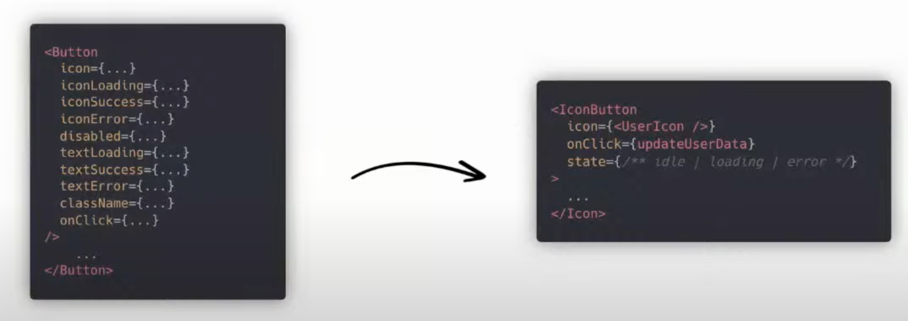

# React Architecture and Best Practices

Video source: https://www.youtube.com/watch?v=XNT5BozA9HA&list=PLFbXZOeg7GKbkk9Fweu4G4jBpm-JFYwJp&index=35&t

- The design of the application should tell you a story
- Group application by modules
- Modules hold the functionality related to it
- Put components in folders
- Following the principle of collocation is a good rule
  - Principle of collocation: grouping related entities together in the same context, location, or module
  - Minimizes distance (physical, conceptual) between related elements
- Create a common module
  - Components, hooks, constants that are used in multiple places could be in the common folder
- The design of your application shouldn't happen by accident
- Use absolute paths: It makes easier to understand where the importing is coming from
  - instead of `../../modules/common/etc.` use `@/modules/common/etc`
- Organize a module
  - dashboard
    - components
    - utils: application that is business-agnostic
    - hooks
    - core: business-specific functionality
      index.js
- Be consistent in your design
- Your business logic shouldn't be affected by UI-driven decisions
- Place your hooks, components as deep inside the application as you can (principle of collocation), and lift it up as other parts of the application need it
- Careful with circular dependencies
- Write deep components: Simple interaction, less exposed props

  - Deep module: hides a lot of complexity and allow access to it through a very simple interface
    
    - Smaller interface to work with
    - Work with less props and more internal config
  - Shallow components: components that expose too much of it's internal and allow its control via props. As a user of this abstraction, you will be aware of everything that it's doing
    - If any of these implementations change, it exposes so much that it's difficult to modify it without breaking it somewhere else
    - All details are exposed.

- Keep public members at the top and private at the bottom

- Organize components

```jsx
// 1. import statements
import {useState} from 'react'
...

// 2. interface/types props
type ComponentProps = {
    ...
}

export function Component({...}:ComponentProps){
    // 3. setup = states and hooks
    const [loading, setLoading] = useState(false)
    const {path, query} = useRouter()

    // separate the setup from the operation

    // 4. body: do something with the components data
    if(loading) {
        return null
    }

    // 5. main returned jsx
    return (
        ...
    )
}

// 6. utility functions, css-in-js components, everything else...
```

- Build custom hooks
  - Create abstractions around the code you write
  - The custom hook can live close to the component

```jsx
function useToggle() {
  const [state, setState] = useState(false);

  const handlers = useMemo(() => ({
    on: () => setState(true),
    off: () => setState(false),
    toggle: () => setState(!state),
  }));

  return [state, handlers];
}

function Component() {
  const [toggle, { on, off, toggle }] = useToggle();
}
```

- Abstract reducer details
